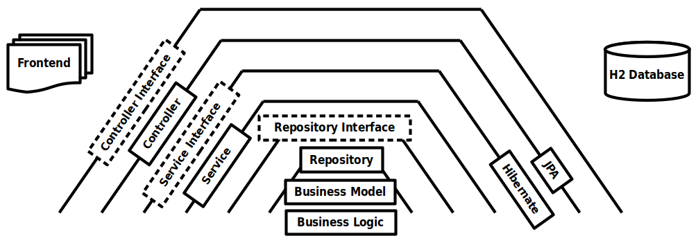

# BcncInditex

## Table of contents
* [General info](#general-info)
* [Statement of the proposed challenge](#statement-of-the-proposed-challenge)
* [Architecture picture](#architecture-picture)
* [Technologies](#technologies)

## General info
Challenge development for a position in Inditex

## Statement of the proposed challenge
[Statement of the proposed challenge](README/doc/java_developer_inditex_statement.pdf)

## Architecture picture

## Technologies
The project has been developed with:
* Java 17
* Spring Boot 3.2.1
* Maven 3.9.5
* SonarLint 10.2.1.77304
* OpenAPI Generator 4.3.1-p0 - https://openapi-generator.tech/
